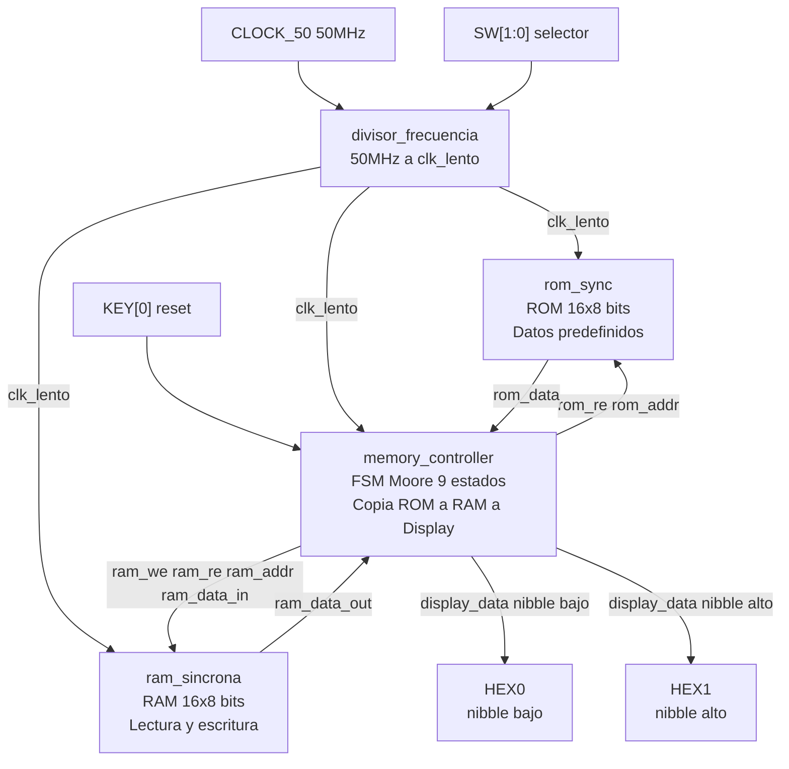
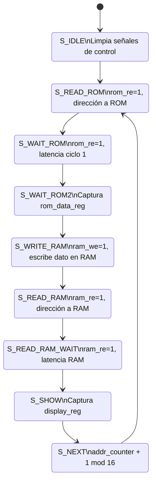

# Sistema ROM-RAM con FSM en VHDL

**Universidad del Cauca**  
**Autor:** Andrés Luna (AndresL2525)  
**Fecha:** Mayo 2026

---

## Descripción

Este proyecto implementa en VHDL un sistema digital que integra una **memoria ROM** (con datos predefinidos), una **memoria RAM** (lectura/escritura) y una **máquina de estados finitos (FSM)** que automatiza el proceso de copiar el contenido de la ROM hacia la RAM y luego mostrar cada dato en dos displays de 7 segmentos (nibble alto y bajo).

El diseño es completamente modular: incluye un paquete de tipos, componentes independientes y un testbench avanzado con aserciones automáticas. La FSM maneja explícitamente la latencia de las memorias síncronas mediante estados de espera, garantizando la correcta temporización.

---

## Cumplimiento del enunciado

| Requisito | Cómo se cumple en este proyecto |
|-----------|----------------------------------|
| Diseñar e implementar en VHDL un sistema digital | Todo el código está escrito en VHDL, sintetizable y simulado. |
| Integre una memoria ROM con datos predefinidos | `rom_sync.vhd` contiene una constante `rom_mem` de tipo `mem_t` con 16 bytes predefinidos. |
| Integre una memoria RAM con capacidad de lectura y escritura | `ram_sincrona.vhd` implementa una RAM síncrona de 16×8 con señales `wr_en` y `rd_en`. |
| Controladas por una lógica secuencial | `memory_controller.vhd` implementa una FSM de 9 estados tipo Moore. |
| Permitir leer datos desde la ROM | La FSM activa `rom_re` y espera la latencia para capturar `rom_data`. |
| Almacenarlos en la RAM | La FSM activa `ram_we` y escribe `rom_data_reg` en la misma dirección. |
| Posteriormente recuperarlos para su visualización | La FSM lee la RAM, espera su latencia y envía el dato a `display_data`. |
| Diseño modular | Cada módulo está en un archivo independiente. |
| Incluir al menos un paquete | `mem_pkg.vhd` define constantes, tipos `data_word`, `addr_word`, `mem_t`, función y procedimiento. |
| Incluir los componentes de memoria | `rom_sync.vhd` y `ram_sincrona.vhd` son componentes independientes y reutilizables. |
| Testbench que valide su funcionamiento | `tb_memory_system.vhd` incluye aserciones automáticas sobre HEX0/HEX1, reset y persistencia. |

---

## Características

- Memoria ROM de 16×8 bits con datos iniciales fijos.
- Memoria RAM de 16×8 bits, inicializada en cero.
- Controlador FSM de 9 estados (Moore) que gestiona la secuencia:
  1. Leer dirección actual desde ROM.
  2. Esperar latencia de ROM (2 ciclos).
  3. Escribir el dato en la misma dirección de RAM.
  4. Leer el dato desde RAM.
  5. Esperar latencia de RAM (2 ciclos).
  6. Mostrar el dato en displays 7 segmentos.
  7. Pasar a la siguiente dirección (0..15) y repetir.
- Decodificador de 7 segmentos (activo bajo) para visualización de dos dígitos hexadecimales.
- Divisor de frecuencia (50 MHz → ~1 Hz) para visualización en FPGA.
- Testbench con pruebas de reset, copia ROM→RAM, verificación de display, persistencia y múltiples resets.

---

## Estructura del repositorio

```
VHDLPrubea/
├── README.md
├── VHDL.pdf
├── dec_7seg.vhd              # Decodificador de 7 segmentos
├── divisor_frecuencia.vhd    # Divisor de 50 MHz a clk_lento
├── mem_pkg.vhd               # Paquete con constantes y tipos
├── memory_controller.vhd     # FSM principal (9 estados Moore)
├── memory_system_top.vhd     # Módulo top estructural
├── ram_sincrona.vhd          # RAM síncrona 16×8 bits
├── rom_sync.vhd              # ROM síncrona 16×8 bits
└── tb_memory_system.vhd      # Testbench avanzado con aserciones
```

---

## Diagramas del sistema

### Diagrama de bloques — arquitectura



### Diagrama de estados — FSM Moore



> La FSM cicla continuamente sobre las 16 posiciones (addr 0..15). Cuando `addr_counter` llega a 15, vuelve a 0 automáticamente en `S_NEXT`.

---

## Contenido de la ROM

| Dirección | Valor hex | Valor binario |
|-----------|-----------|---------------|
| 0  | `0xAA` | 1010 1010 |
| 1  | `0x55` | 0101 0101 |
| 2  | `0xF0` | 1111 0000 |
| 3  | `0x0F` | 0000 1111 |
| 4  | `0xFF` | 1111 1111 |
| 5  | `0x00` | 0000 0000 |
| 6  | `0xA5` | 1010 0101 |
| 7  | `0x5A` | 0101 1010 |
| 8  | `0x12` | 0001 0010 |
| 9  | `0x34` | 0011 0100 |
| 10 | `0x56` | 0101 0110 |
| 11 | `0x78` | 0111 1000 |
| 12 | `0x9A` | 1001 1010 |
| 13 | `0xBC` | 1011 1100 |
| 14 | `0xDE` | 1101 1110 |
| 15 | `0xEF` | 1110 1111 |

---
