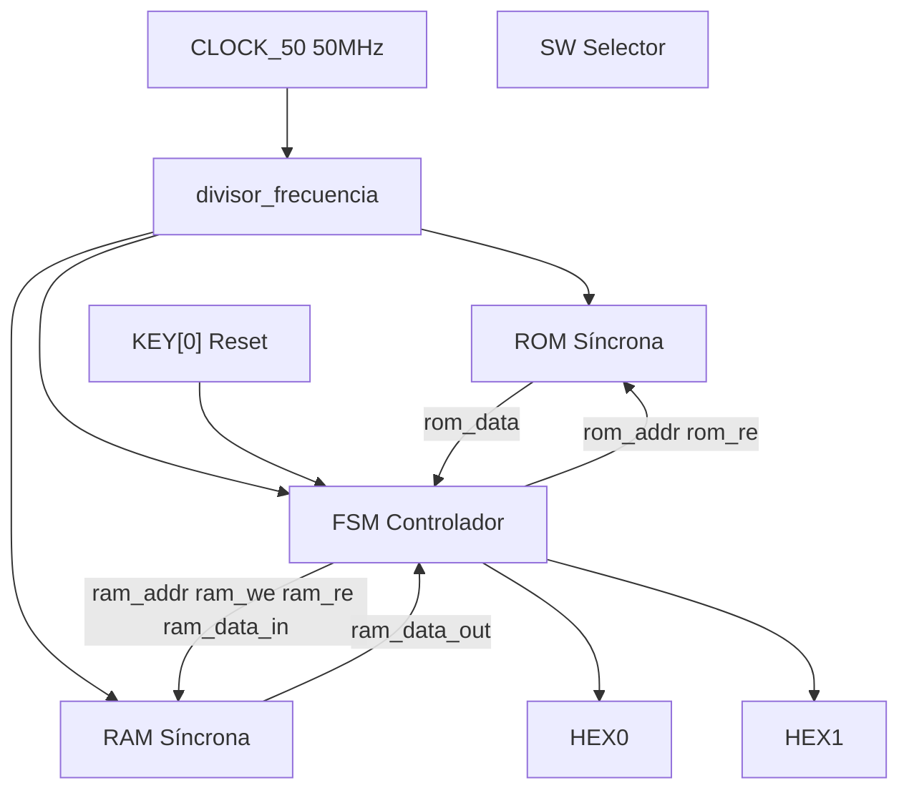
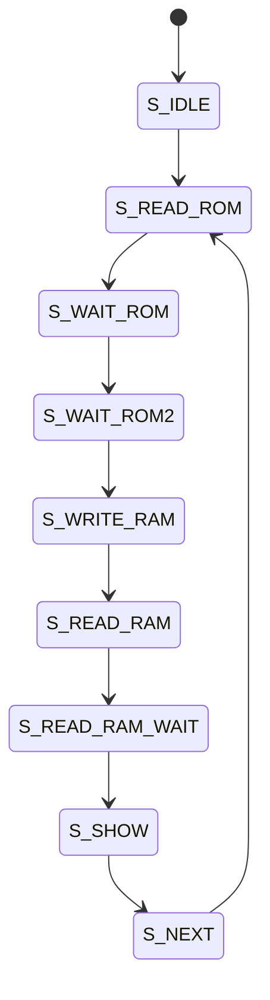
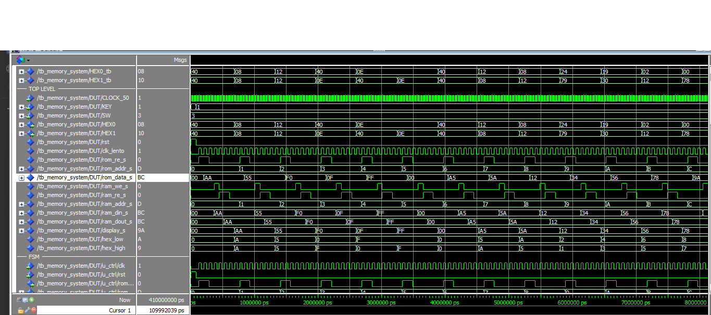

# Sistema ROM-RAM con FSM en VHDL

**Universidad del Cauca**  
**Autor:** Andrés Luna (AndresL2525)  
**Fecha:** Mayo 2026

---

## Descripción

Este proyecto implementa en VHDL un sistema digital que integra una **memoria ROM** (con datos predefinidos), una **memoria RAM** (lectura/escritura) y una **máquina de estados finitos (FSM)** que automatiza el proceso de copiar el contenido de la ROM hacia la RAM y luego mostrar cada dato en dos displays de 7 segmentos (nibble alto y bajo).

El diseño es completamente modular: incluye un paquete de tipos, componentes independientes y un testbench avanzado con aserciones automáticas. La FSM maneja explícitamente la latencia de las memorias síncronas mediante estados de espera, garantizando la correcta temporización.

---

# Cumplimiento del enunciado

| Requisito | Cómo se cumple en este proyecto |
|-----------|----------------------------------|
| Diseñar e implementar en VHDL un sistema digital | Todo el código está escrito en VHDL, sintetizable y simulado. |
| Integrar una memoria ROM con datos predefinidos | `rom_sync.vhd` contiene una ROM síncrona de 16×8 bits inicializada. |
| Integrar una memoria RAM con capacidad de lectura y escritura | `ram_sincrona.vhd` implementa una RAM síncrona con `wr_en` y `rd_en`. |
| Controladas por lógica secuencial | `memory_controller.vhd` implementa una FSM Moore de 9 estados. |
| Permitir leer datos desde ROM | La FSM activa `rom_re` y espera la latencia de lectura. |
| Almacenar los datos en RAM | La FSM escribe `rom_data_reg` en RAM usando `ram_we`. |
| Recuperar datos para visualización | La FSM lee RAM y actualiza `display_data`. |
| Diseño modular | Cada módulo está separado en archivos independientes. |
| Uso de package VHDL | `mem_pkg.vhd` contiene constantes, tipos, función y procedimiento. |
| Uso de funciones y procedimientos | Se implementan dentro del package para reutilización. |
| Uso de componentes | ROM, RAM y controlador son componentes independientes. |
| Testbench funcional | `tb_memory_system.vhd` verifica reset, ROM, RAM y displays. |

---

# Características del sistema

- ROM síncrona de 16×8 bits.
- RAM síncrona de 16×8 bits.
- FSM Moore de 9 estados.
- Visualización hexadecimal en displays de 7 segmentos.
- Divisor de frecuencia para observación en FPGA.
- Testbench automatizado.
- Arquitectura modular y reutilizable.
- Compatible con Quartus y ModelSim.
- Implementado para FPGA Cyclone III DE0.

---

# Arquitectura del sistema



---

# Máquina de Estados (FSM)

La FSM implementada es de tipo **Moore** y controla toda la secuencia del sistema.

## Estados implementados

| Estado | Función |
|---|---|
| `S_IDLE` | Inicialización del sistema |
| `S_READ_ROM` | Solicita lectura desde ROM |
| `S_WAIT_ROM` | Espera latencia ROM |
| `S_WAIT_ROM2` | Captura dato ROM |
| `S_WRITE_RAM` | Escribe dato en RAM |
| `S_READ_RAM` | Solicita lectura RAM |
| `S_READ_RAM_WAIT` | Espera latencia RAM |
| `S_SHOW` | Actualiza displays |
| `S_NEXT` | Incrementa dirección |

---

## Diagrama FSM



---

# Flujo de funcionamiento

```text
RESET
↓
FSM limpia señales
↓
Lee ROM[0]
↓
Escribe RAM[0]
↓
Lee RAM[0]
↓
Muestra dato en HEX0 y HEX1
↓
Incrementa dirección
↓
Repite hasta dirección 15
↓
Vuelve a dirección 0
```

---

# Contenido de la ROM

| Dirección | Valor Hex | Valor Binario |
|-----------|-----------|----------------|
| 0  | AA | 10101010 |
| 1  | 55 | 01010101 |
| 2  | F0 | 11110000 |
| 3  | 0F | 00001111 |
| 4  | FF | 11111111 |
| 5  | 00 | 00000000 |
| 6  | A5 | 10100101 |
| 7  | 5A | 01011010 |
| 8  | 12 | 00010010 |
| 9  | 34 | 00110100 |
| 10 | 56 | 01010110 |
| 11 | 78 | 01111000 |
| 12 | 9A | 10011010 |
| 13 | BC | 10111100 |
| 14 | DE | 11011110 |
| 15 | EF | 11101111 |

---

# Funciones y Procedimientos

El proyecto utiliza un package VHDL (`mem_pkg.vhd`) para centralizar definiciones reutilizables.

## Función

```vhdl
function addr_to_integer(addr : std_logic_vector) return integer;
```

Convierte una dirección `std_logic_vector` a entero para indexar memorias.

## Procedimiento

```vhdl
procedure clear_control_signals(...)
```

Limpia señales de control de la FSM:

- `rom_re`
- `ram_we`
- `ram_re`

---

# Estructura del repositorio

```text
VHDLPrubea/
│
├── README.md
├── mem_pkg.vhd
├── rom_sync.vhd
├── ram_sincrona.vhd
├── memory_controller.vhd
├── memory_system_top.vhd
├── divisor_frecuencia.vhd
├── dec_7seg.vhd
├── tb_memory_system.vhd
│
├── imagenes/
│   └── simulacion.png
│
└── docs/
    └── informe.pdf
```

---

# Evidencia de simulación

La siguiente simulación muestra:

- Lectura desde ROM.
- Escritura en RAM.
- Lectura desde RAM.
- Actualización de displays HEX0 y HEX1.
- Funcionamiento correcto de la FSM.
- Avance automático de direcciones.

## Simulación en ModelSim



---

# Archivos principales

| Archivo | Descripción |
|---|---|
| `mem_pkg.vhd` | Package con constantes, tipos, función y procedimiento |
| `rom_sync.vhd` | ROM síncrona inicializada |
| `ram_sincrona.vhd` | RAM síncrona parametrizable |
| `memory_controller.vhd` | FSM Moore principal |
| `memory_system_top.vhd` | Integración estructural |
| `divisor_frecuencia.vhd` | Generación de reloj lento |
| `dec_7seg.vhd` | Conversión hexadecimal a display |
| `tb_memory_system.vhd` | Testbench automatizado |

---

# Señales principales

| Señal | Función |
|---|---|
| `clk` | Reloj del sistema |
| `rst` | Reset síncrono |
| `addr` | Dirección de memoria |
| `data_in` | Entrada de datos |
| `data_out` | Salida de datos |
| `we` | Write enable |
| `re` | Read enable |

---

# Validaciones realizadas

## Reset del sistema

Se verificó:

- Reinicio correcto de FSM.
- Limpieza de registros.
- Reinicio de dirección.

## Lectura desde ROM

La FSM obtiene correctamente cada dato almacenado.

## Escritura en RAM

Cada dato leído desde ROM es almacenado en RAM.

## Lectura desde RAM

Los datos almacenados son recuperados correctamente.

## Visualización

HEX0 y HEX1 muestran correctamente el nibble bajo y alto.

---

# Herramientas utilizadas

- Quartus Prime
- ModelSim
- FPGA DE0 Cyclone III
- VHDL IEEE STD_LOGIC_1164
- IEEE NUMERIC_STD

---

# Resultado final

El sistema implementado cumple correctamente todos los requisitos del enunciado:

- Uso de ROM inicializada.
- Uso de RAM lectura/escritura.
- Implementación mediante FSM Moore.
- Uso de package VHDL.
- Uso de funciones y procedimientos.
- Diseño modular.
- Simulación funcional.
- Visualización en FPGA.

---

# Autor

**Andrés Luna**  
Ingeniería Electrónica y Telecomunicaciones  
Universidad del Cauca
